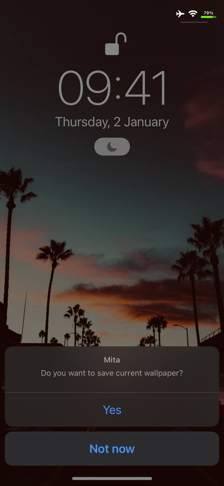

# Mita

Save your lockscreen wallpaper simply like never before by triple tapping the screen.

## Preview

  
  

## Installation

1. Download the latest <code style="background-color: #2c2f33; color: white; padding: 2px 5px; border-radius: 3px;">deb</code> from the [releases](https://github.com/Kesa2773/Mita/releases).  
2. Install Mita.

## Compatibility

iPhone, iPad, and iPod running iOS/iPadOS 13 or later.

## Compiling

1. [Theos](https://theos.dev) is required to compile the project. 
2. Run the build in the terminal using the command <code style="background-color: #2c2f33; color: white; padding: 2px 5px; border-radius: 3px;">make clean && make package THEOS_PACKAGE_SCHEME=rootless</code> or <code style="background-color: #2c2f33; color: white; padding: 2px 5px; border-radius: 3px;">make clean package</code> depending on your Jailbreak type.

## Socials

## License

[GPLv3 License](./LICENSE)
